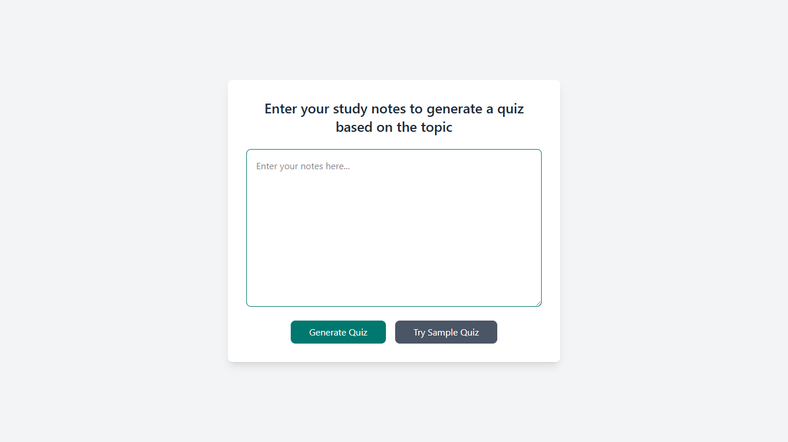
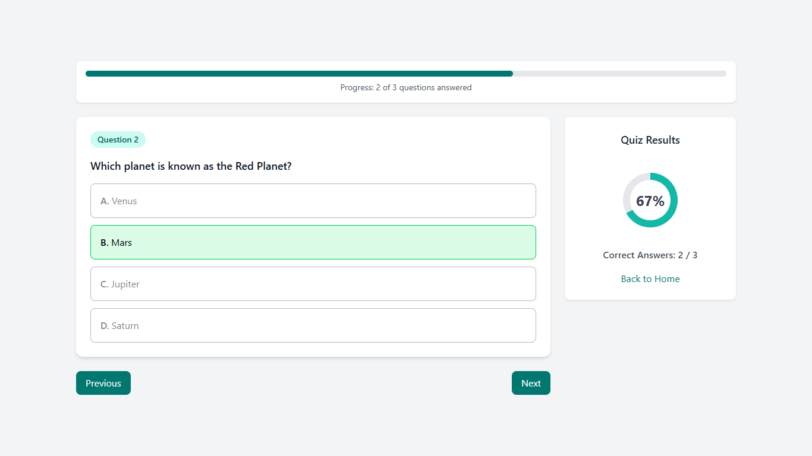

# 📒 Notes-to-Quiz

Notes-to-Quiz is an AI Powered React + Vite application designed to transform your notes into interactive quizzes. The app provides a seamless way to create, manage, and take quizzes based on your study material, making learning more engaging and effective.

## ⚠️ Important

This app requires a .env file with the following environment variables to function properly:

```
VITE_GITHUB_TOKEN=your_github_token
VITE_GITHUB_MODEL=your_model # Personally I used openai/gpt-4.1
```
You can generate and manage your GitHub token at: https://github.com/settings/tokens

## 🖼️ Screenshots

### Home


### Quiz


## ✨ Features

- 📝 **Notes to Quiz Conversion:** Automatically generate quizzes from your notes.
- 📊 **Interactive Charts:** Visualize quiz performance with donut charts.
- 🖱️ **User-Friendly Interface:** Simple and intuitive navigation.
- ⚡ **Fast and Modern:** Built with React and Vite for optimal performance.

## 🚀 Installation Guide

1. Clone or download this repository.
2. Install dependencies:
   ```cmd
   npm install
   ```
3. Start the development server:
   ```cmd
   npm run dev
   ```
4. Open the application in your browser at `http://localhost:5173`.

## 📁 Project Structure

- `src/` - Main application source code.
  - `App.jsx` - Main application component.
  - `components/` - Reusable UI components (e.g., `DonutChart.jsx`, `QuestionCard.jsx`).
  - `services/` - Service files for handling quiz logic (e.g., `quizService.js`).
  - `index.css` - Global styles.
  - `main.jsx` - Application entry point.
- `public/` - Static assets (e.g., `vite.svg`).
- `tailwind.config.js` - Tailwind CSS configuration.
- `vite.config.js` - Vite configuration.

## 📄 License

This project is licensed under the MIT License. See [LICENSE](LICENSE) for details.
